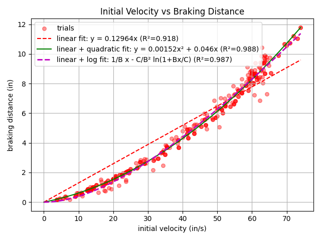

## What is Black Ice?
Black Ice is the path follower I developed that introduced [predictive braking](https://pedropathing.com/docs/pathing/reference/predictive). The name comes from my former FTC team, Frozen Code, and the robot's sliding behavior while braking. The idea is that, if tuned for black ice, the robot could still navigate a seemingly uncontrollable, slippery surface by predicting how far it would travel before stopping.

## [v0.5 (December, 2024)](https://github.com/jjophoven/FrozenCodeIntoTheDeep-BlackIceV0.5)

- Single wheel encoder to estimate linear displacement + IMU for heading lock
- Once the robot reached the target position, it would set the power to zero on [zero power brake mode](https://ftctechnh.github.io/ftc_app/doc/javadoc/com/qualcomm/robotcore/hardware/DcMotor.ZeroPowerBehavior.html#BRAKE)
- Worked very well for simplicity, but was limited to about 50% power because higher speeds caused overshoot and encoder wheel slip.

## [v1.0 (February, 2025)](https://github.com/jjophoven/FrozenCodeIntoTheDeep-BlackIceV1)
Switched to dead-wheel odometry so the robot could drive faster without localization slipping.
{: .notice}

### Why Reinvent the Wheel?
Seeing how quickly the robot could stop using zero power brake mode made me question why existing path followers (such as RoadRunner) gradually accelerated and decelerated instead of braking as late as possible. Since dead-wheel odometry measures motion independently of wheel slip, I expected the robot could drive at full power until the last moment before braking.

Looking back, that assumption wasn't entirely correct. Many of the robots I watched either lacked dead-wheel odometry or simply weren't well tuned. Even so, my curiosity got the better of me and ultimately led to predictive braking.

### Predicting Braking Distance
I knew I couldn't just switch to brake mode because the robot would overshoot the target. To solve this, I used system identification and wrote a program that measured how far the robot traveled while braking from different initial speeds using zero power brake mode. After graphing the relationship between velocity and braking distance, I found the data was well approximated by the equation `d(v) = av² + bv` (R² = 0.99). I then used quadratic regression in that form to fit a function that accurately predicted the braking distance at any speed.


*Velocity to braking distance data points*

I initially used this braking distance to set the power to zero on [zero power brake mode](https://ftctechnh.github.io/ftc_app/doc/javadoc/com/qualcomm/robotcore/hardware/DcMotor.ZeroPowerBehavior.html#BRAKE) as soon as the distance remaining became less than the braking distance. This worked reasonably well, but it could not correct while braking, so the robot would often turn or drift while sliding.

### Predictive PID Controller

To eliminate braking drift, I used a proportional controller that controlled the robot's **predicted stopping position** instead of its current position. Rather than asking, "Where am I now?", the controller asked, "Where will I end up if I slam on the brakes right now?"

By treating braking distance as reaction time, it allowed the controller to empirically anticipate overshoot from predicting future error. Instead of reacting after the robot had already overshot, it could begin correcting beforehand and while the robot was still braking, making it significantly more accurate.

The same idea also allowed the robot to begin transitioning to the next waypoint before fully reaching the current one. This allowed the robot to speed through consecutive waypoints instead of stopping at each one.

Pseudo-code implementation of the **predictive braking controller**:
```java
predictedBrakingDisplacement = a*velocity*abs(velocity) + b*velocity
predictedPositionAfterBraking = current + predictedBrakingDisplacement
error = target - predictedPositionAfterBraking
power = error * kProportionalConstant
```

**Fun Fact:** I originally thought our algorithm was falling apart here because it consistently stopped several inches from the target, so I tried adding Integral terms, but eventually I figured out that one of our odometry pods was just defective and GoBilda was able to ship us a replacement. In a way the defective odometry pod pushed me to improve the control system to be able to correct while it was braking.

An [extension of this version](https://github.com/jjophoven/BlackIceV1.5-Experimental-Developement/commit/0d222ad8d032575517fda20ac19eec711f3a541a) also introduced curve following by approximating curves with points spaced 1–2 inches apart.

## [v2.0 (August, 2025)](https://github.com/jjophoven/BlackIceV2-PathRoutines)

Introduced continuous path following using tangent, perpendicular, and heading vectors similar to Pedro Pathing.
{: .notice}

It also supported custom velocity profiles and slower deceleration through PIDFs with momentum compensation.

## [v3.0 (February, 2026)](https://github.com/jjophoven/BlackIceV3-AutoRoutines)

Integrated `AutoRoutines` which combined path following with a command-based autonomous library.
{: .notice}