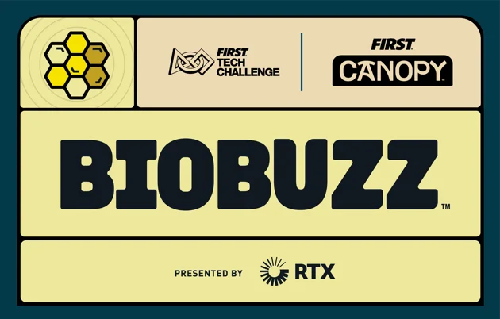
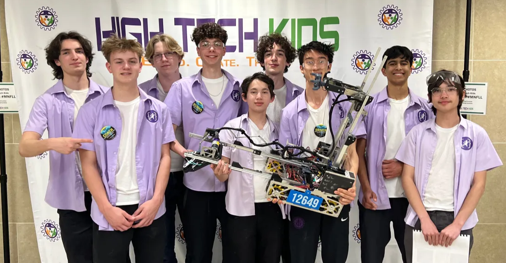
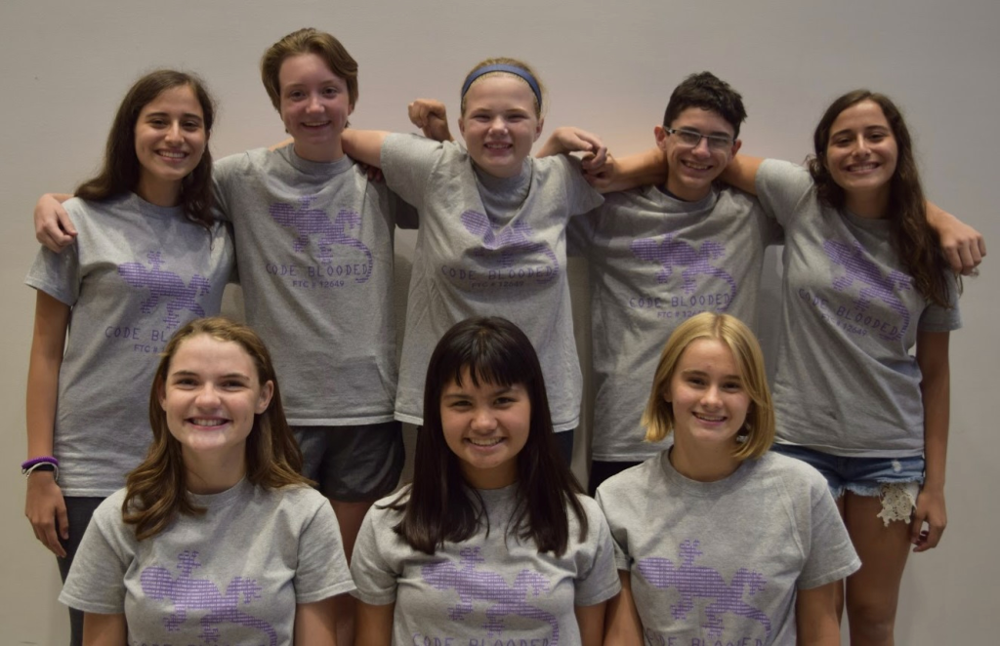

## Upcoming [2026-27 Biobuzz](https://www.firstinspires.org/programs/ftc/game-and-season)

## Most Recent [2025-26 Decode](https://firstroboticsbc.org/ftc/decode-season/)
Won 2nd place Think award at State. Advanced to Worlds and ended **1st in MN** for OPR with the 3rd Place Control Award.

## 2024-25 Into the Deep 
– at Qualifiers; Advanced to State, 6th Alliance partner

## 2023-24 Centerstage
Innovate & Motivate finalist, 1st place Inspire at League Qualifiers; Advanced to State, Kai Hendricks Dean’s List Finalist @ State

## 2022-23 Power Play
Advanced to State, Motivate Award finalist at State

## 2021-22 Freight Frenzy
 Stratasys finalist, captain winning alliance, 1st Inspire Winner & finalist captain at League Qualifiers; Advanced to State, Connect Award winner at State

## 2020-21 Ultimate Goal (COVID Remote season)
Think Award winner & 2nd place Inspire; Advanced to State, Collins Aerospace & Connect finalist, Sophie Mack Dean’s List Finalist at State

## 2019-20 Skystone
Stratasys & 1st place Inspire winner, 1st team chosen winning alliance at League Qualifiers; Advanced to State, Control award finalist & Motivate Winner at State

## 2018-19 Rover Ruckus
Stratasys & Think finalist, 1st place Inspire at League Qualifiers; Advanced to State

## 2017-18 Relic Recovery
Innovate finalist at qualifiers
